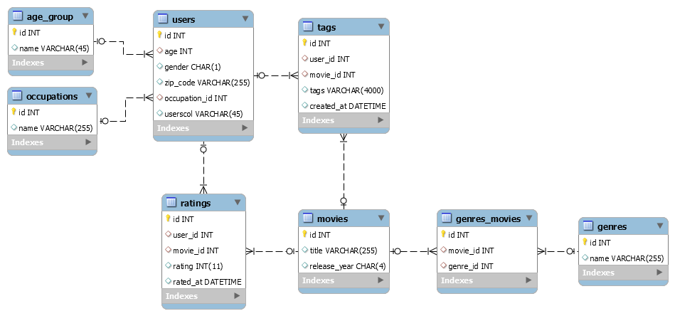
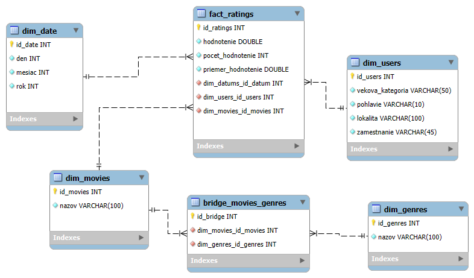
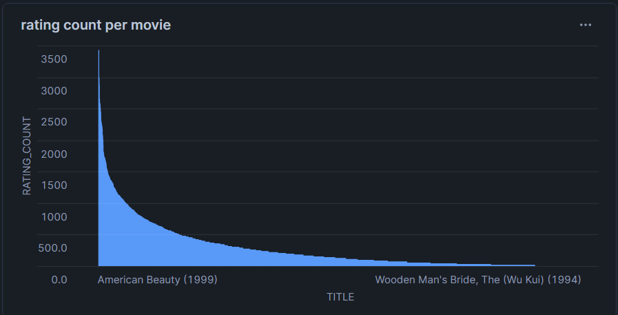
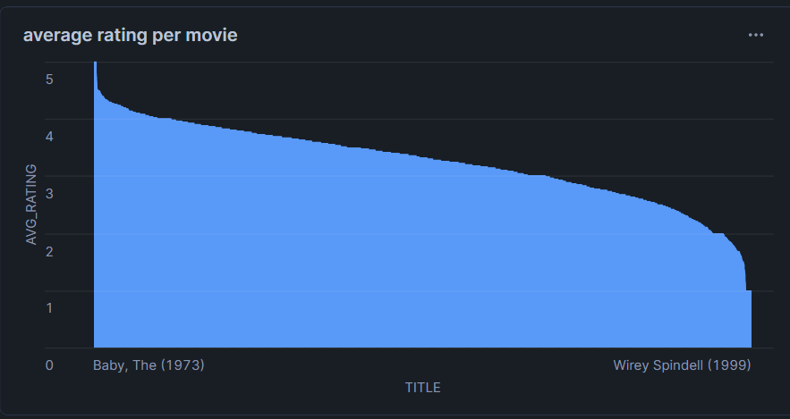
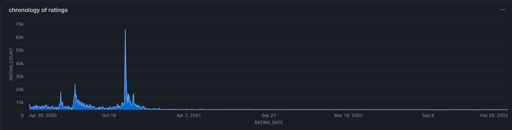
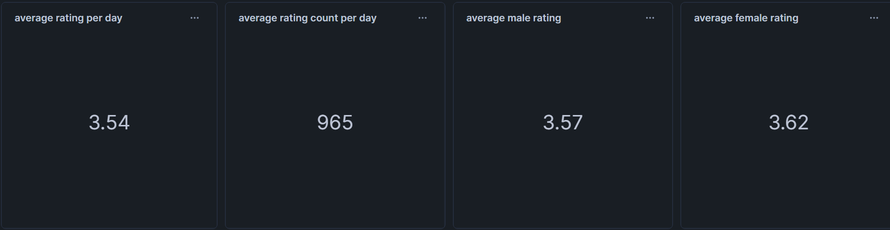
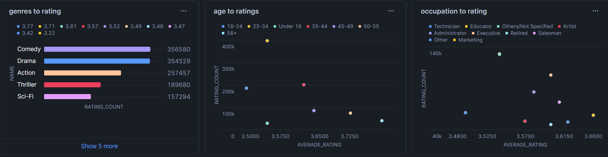

# ETL proces datasetu MovieLens

Tento repozitar obsahuje implementaciu ETL procesu pre analyzu dat z datasetu MovieLens. Proces zahrna kroky na extrahovanie, transformovanie a nacitanie dat do dimenzionalneho modelu v Snowflake. Tento model podporuje vizualizaciu a analyzu filmov, uzivatelov a ich hodnoteni.

## 1. Uvod a popis zdrojovych dat

Cielom tejto prace bolo uskutocnit analyzu dat, ktore sa tykaju filmov a ich zanrov, hodnoteni, uzivatelov a ich demografickych udajov. Tato analyza umoznuje identifikovat chronologiu mnozstva hodnoteni filmov od roku 2000 do 2003 vratane a takisto pomer hodnoteni (kvantitativne a kvalitativne) za den, popularnost konkretnych zanrov, zavislost hodnoteni (kvantitativne a kvalitativne) od sektorov prace uzivatelov, ich vekovej ci genderovej prislusnosti. Odkaz na DB najdete [tu](https://grouplens.org/datasets/movielens/).

### Zdrojove data:
- `ratings.csv`: Hodnotenia filmov uzivatelmi.
- `movies.csv`: Informacie o filmoch.
- `genres_movies.csv`: Relacna tabulka N:M medzi filmami a zanrami.
- `genres.csv`: Zanre filmov.
- `users.csv`: Demograficke udaje o uzivateloch.
- `occupations.csv`: Zamestnania.
- `age_group.csv`: Vekove skupiny.

### 1.1 Datova architektura

ERD diagram MovieLens:

|  |
|:-:|
|*Obrazok 1: Entitno-relacna schema MovieLens*|

## 2. Dimenzionalny model

Bol navrhnuty hviezdicovy model (star schema), kde centralnou tabulkou faktov je `fact_ratings`, na ktoru sa pripajaju dalsie dimenzie:

- `dim_date` - datumy hodnoteni (den, mesiac, rok).
- `dim_movies` - nazvy filmov.
- `dim_users` - demograficke udaje uzivatelov: vekova kategoria, pohlavie, lokalita, zamestnanie.

Kvoli relacii N:M medzi entitami `movies` a `genres` bolo rozhodnute vyuzit `bridge` pre spravne mapovanie:

- `dim_genres` - nazvy zanrov.

Struktura schemy je znazornena nizsie:

|  |
|:-:|
|*Obrazok 2: Star schema MovieLens*|

## 3. ETL proces v Snowflake

ETL proces pozostaval z troch hlavnych faz: extrahovanie (Extract), transformacia (Transform) a nacitanie (Load). Tento proces bol implementovany v Snowflake s cielom pripravit zdrojove data zo staging vrstvy do dimenzionalneho modelu, ktory moze byt nasledne analyzovany a vizualizovany.

### 3.1 Extract

`.csv` subory boli najprv nahrate pomocou interneho stage `my_stage`, co bolo realizovane prikazom:

```sql
CREATE OR REPLACE STAGE my_stage FILE_FORMAT = (TYPE = 'CSV' FIELD_OPTIONALLY_ENCLOSED_BY = '"');
```

Nasledujucim krokom bolo nahranie obsahu kazdeho `.csv` suboru do staging tabulky. Pre kazdu tabulku sa pouzivali podobne prikazy

1. Vytvorenie

```sql
CREATE OR REPLACE TABLE ratings_staging (
    id INT,
    userId INT,
    movieId INT,
    rating FLOAT,
    timestamp STRING
);
```

2. Importovanie dat

```sql
COPY INTO ratings_staging
FROM @my_stage/ratings.csv
FILE_FORMAT = (TYPE = 'CSV' FIELD_OPTIONALLY_ENCLOSED_BY = '"' SKIP_HEADER = 1);
```

3. Overenie spravnosti operacii:

```sql
SELECT * FROM ratings_staging;
```

### 3.2 Transform

V tejto faze sa vykonavalo cistenie, transformacia a obohacovanie dat zo staging tabuliek. Hlavnym cielom bolo pripravenie dimenzii a faktovej tabulky na jednoduchu a efektivnu analyzu.

Prvym krokom bolo vytvorenie dimenzii:
- `dim_users` - bola vytvorena join operaciou medzi tabulkami `occupations_staging` a `age_group_staging`, co umoznilo denormalizaciu. Tabulka `dim_users` obsahuje popis vekovych kategorii (napr. "25-34") a pracovnych sektorov (napr. "Lawyer").<br>
***Typ dimenzie: SCD1 (Slowly Changing Dimensions - Overwrite Old Value)***<br>
Informacie o uzivateloch mozu byt aktualizovane bez ulozenia historickych zmien.

```sql
CREATE OR REPLACE TABLE dim_users AS
SELECT DISTINCT
    userId,
    a.name AS agegroup,
    gender,
    o.name AS occupation,
    zipCode
FROM users_staging u
JOIN occupations_staging o ON u.occupation = o.occupationid
JOIN age_group_staging a ON u.age = a.agegroupid; 
```

- `dim_movies` a `dim_genres` - obsahovali iba nazvy. Pri transformacii tabulky `movies_staging` bol vynechany stlpec `release_year`, pretoze analyza sa na tieto data nezameriava.<br>
***Typ dimenzii: SCD0 (Slowly Changing Dimensions - Retain  Original Value)***<br>
Nazvy filmov a zanrov sa casom nemenia.

```sql
CREATE OR REPLACE TABLE dim_movies AS
SELECT
    DISTINCT movieId,
    title
FROM movies_staging;

CREATE OR REPLACE TABLE dim_genres AS
SELECT
    DISTINCT genreId,
    name
FROM genres_staging;
```

- `dim_date` - jej ID reprezentuje presny datum (rok-mesiac-den) a obsahuje tieto hodnoty aj separatne ako typ INT. Je strukturovana na vhodnu casovu analyzu.<br>
***Typ dimenzie: SCD0 (Slowly Changing Dimensions - Retain  Original Value)***<br>
Datumy sa po ulozeni nemenia.

```sql
CREATE OR REPLACE TABLE dim_date AS
SELECT
    DISTINCT
    TO_DATE(TO_TIMESTAMP(timestamp, 'YYYY-MM-DD HH24:MI:SS')) AS date,
    DATE_PART('year', TO_TIMESTAMP(timestamp, 'YYYY-MM-DD HH24:MI:SS')) AS year,
    DATE_PART('month', TO_TIMESTAMP(timestamp, 'YYYY-MM-DD HH24:MI:SS')) AS month,
    DATE_PART('day', TO_TIMESTAMP(timestamp, 'YYYY-MM-DD HH24:MI:SS')) AS day
FROM ratings_staging;
```

- `fact_ratings` - obsahuje metriky (rating) a cudzie kluce na prislusne dimenzie (`movieId`, `userId`, `dateId`).


```sql
CREATE OR REPLACE TABLE fact_ratings AS
SELECT
    r.userId,
    r.movieId,
    r.rating,
    d.date AS dateId
FROM ratings_staging r
JOIN dim_date d ON CAST(r.timestamp AS DATE) = d.date;
```

### 3.3 Load

Po vytvoreni dimenzii a faktovej tabulky boli data nahrate do tychto tabuliek. Nasledne boli staging tabulky odstranene pre optimalizaciu vyuzitia uloziska.

```sql
DROP TABLE IF EXISTS ratings_staging;
DROP TABLE IF EXISTS movies_staging;
DROP TABLE IF EXISTS genres_movies_staging;
DROP TABLE IF EXISTS genres_staging;
DROP TABLE IF EXISTS users_staging;
DROP TABLE IF EXISTS occupations_staging;
DROP TABLE IF EXISTS age_group_staging; 
```

Vysledkom ETL procesu bolo rychle a efektivne spracovanie `.csv` suborov pre vytvorenie definovaneho multidimenzionalneho modelu typu star. Na dalsiu analyzu boli vytvorene `View` v scheme `analysis`:

- `rating_count_stats` - poskytuje spojenie s `dim_movies` na ziskanie priemeru (kvalitativ) a poctu (kvantitativ) hodnoteni pre kazdy film:

```sql
CREATE OR REPLACE VIEW analysis.rating_count_stats AS
SELECT 
    m.title,
    COUNT(rating) AS rating_count,
    ROUND(AVG(rating), 2) AS avg_rating
FROM etl_staging.fact_ratings f
JOIN etl_staging.dim_movies m ON f.movieId = m.movieId
GROUP BY f.movieId, m.title;
```

- `user_rating_stats` - poskytuje spojenie s `dim_users` na analyzu zavislosti hodnoteni od demografickych parametrov:

```sql
CREATE OR REPLACE VIEW analysis.user_rating_stats AS
SELECT
    u.gender,
    u.occupation,
    u.agegroup,
    rating
FROM 
    etl_staging.fact_ratings f
JOIN 
    etl_staging.dim_users u
ON f.userid = u.userid;
```

- `genre_rating_stats` - analyzuje vztah medzi zanrami a hodnoteniami (kvalitativ a kvantitativ):

```sql
CREATE OR REPLACE VIEW analysis.genre_rating_stats AS
SELECT 
    g.name,
    COUNT(f.rating) AS rating_count,
    ROUND(AVG(f.rating), 2) AS average_rating
FROM 
    etl_staging.fact_ratings f
JOIN 
    etl_staging.bridge_genres_movies b
ON 
    f.movieid = b.movieid
JOIN
    etl_staging.dim_genres g
ON 
    b.genreid = g.genreid
GROUP BY 
    g.name;
```

- `date_rating_stats` - analyzuje chronologiu hodnoteni a ich kvalitativne a kvantitativne parametre:

```sql
CREATE OR REPLACE VIEW analysis.date_rating_stats AS
SELECT
    d.year,
    d.month,
    d.day,
    COUNT(rating) AS rating_count,
    ROUND(AVG(rating), 2) AS average_rating
FROM
    etl_staging.fact_ratings f
JOIN 
     etl_staging.dim_date d
ON 
    f.dateid = d.date
GROUP BY
    d.year, d.month, d.day
ORDER BY
    d.year, d.month, d.day ASC;
```

## 4. Vizualizacia dat

Bolo navrhnutych `10 vizualizacii`

### 1. Pocet hodnoteni pre kazdy film

|  |
|:-:|
|*Obrazok 3 pocet hodnoteni pre kazdy film*|

Umoznuje zobrazit pocet hodnoteni pre kazdy film. Z grafu mozeme zistit, ze najviac hodnoteni ma film `American Beauty (1999)` ***(az 3428)*** a najmenej - `Wooden Man's Bride, The (Wu Kui) (1994)` ***(iba 1)***. Taktiez ihlovity tvar grafu na zaciatku svedci o tom, ze rozdiel v pocte hodnoteni medzi popularnymi filmami je velky, ale zaroven hladky tvar grafu na konci naznacuje opacny jav - rozdiel medzi menej hodnotenymi filmami je maly.

```sql
SELECT title, rating_count FROM analysis.rating_count_stats;
```

### 2. Priemer hodnoteni pre kazdy film

|  |
|:-:|
|*Obrazok 4 priemer hodnoteni pre kazdy film*|

Umoznuje zobrazit priemer hodnoteni pre kazdy film. Z grafu mozeme zistit, ze najvyssie hodnotenie ma film `Baby, The (1973)` ***(az 5)*** a najnizsie - `Wirey Spindell (1999)` ***(iba 1)***. Ihlovity tvar grafu na okrajoch a hladky stred svedcia o tom, ze je malo filmov s velmi vysokym alebo velmi nizkym hodnotenim, ale vacsina filmov ma uspokojive hodnotenie.

```sql
SELECT title, rating_count FROM analysis.rating_count_stats;
```

### 3. Chronoligia hodnoteni

|  |
|:-:|
|*Obrazok 5 Chronoligia hodnoteni*|

Zobrazuje pocet hodnoteni na casovej osi. Z grafu mozeme zistit, ze do polovice novembra 2000 uzivatelia hodnotili filmy aktivne, az po anomaliu 20.11.2000 s poctom hodnoteni 61754. Po tomto datume aktivita uzivatelov zacala klesat. Moznym dovodom moze byt zaciatocna popularita platformy, aktivna promocia filmov 20.11.2000 a nasledny pokles popularity platformy.

```sql
SELECT TO_DATE(CONCAT(year, '-', LPAD(month, 2, '0'), '-', LPAD(day, 2, '0'))) AS rating_date, rating_count FROM date_rating_stats;
```

### 4-7. Ciselne vysledky

|  |
|:-:|
|*Obrazok 6 Ciselne vysledky*|

4. Hodnota priemerneho hodnotenia za den je `3.54`, co je uspokojive.

```sql
SELECT AVG(average_rating) FROM date_rating_stats;
```

5. Hodnota priemerneho poctu hodnoteni za den je `965`, co svedci o dostatocnej aktivite pocas celeho obdobia.

```sql
SELECT ROUND(AVG(rating_count)) FROM date_rating_stats;
```

6. a 7. Z vysledkov vidime, ze priemerne hodnotenie uzivatelov s genderom M je o trochu nizsie ako uzivatelov s genderom F.

```sql
SELECT ROUND(AVG(rating),2) FROM user_rating_stats WHERE gender LIKE 'M';

SELECT ROUND(AVG(rating),2) FROM user_rating_stats WHERE gender LIKE 'F';
```

### 8-10. Zanre, vek a zamestnania ku hodnoteniam

|  |
|:-:|
|*Obrazok 7 Zanre, vek a zamestnania ku hodnoteniam*|

8. Z grafu vidime, ze najpopularnejsi zaner je `Comedy`, ale najvyssie priemerne hodnotenie ma `Drama`.

```sql
SELECT name, rating_count, average_rating FROM genre_rating_stats ORDER BY rating_count DESC LIMIT 10;
```

9. Z grafu vidime, ze najviac hodnoteni pochadza od vekovej skupiny `25-34`, ale najvyssie priemerne hodnotenie pochadza od skupiny `56+`.

```sql
SELECT agegroup, COUNT(rating) AS rating_count, ROUND(AVG(rating), 2) AS average_rating FROM user_rating_stats GROUP BY agegroup;
```

10. Z grafu vidime, ze najviac hodnoteni pochadza od uzivatelov z pracovneho sektora `Educator`, ale najvyssie priemerne hodnotenie pochadza od sektora `Marketing`.

```sql
SELECT occupation, ROUND(AVG(rating), 2) AS average_rating, COUNT(rating) AS rating_count FROM user_rating_stats GROUP BY occupation ORDER BY rating_count DESC LIMIT 10;
```

Dashboard poskytuje detailny a prehladny pohlad na analyzovane data, odpoveda na klucove otazky tykajuce sa hodnoteni filmov, preferencii uzivatelov a ich spravania. Vizualizacie umoznuju jednoduchu interpretaciu dat, pricom poskytuju uzitocne poznatky pre dalsiu optimalizaciu filmovych odporucacich systemov, marketingovych kampani a strategii na zvysenie zapojenia uzivatelov.

<hr>

Autor: Tymofii Sukhariev
